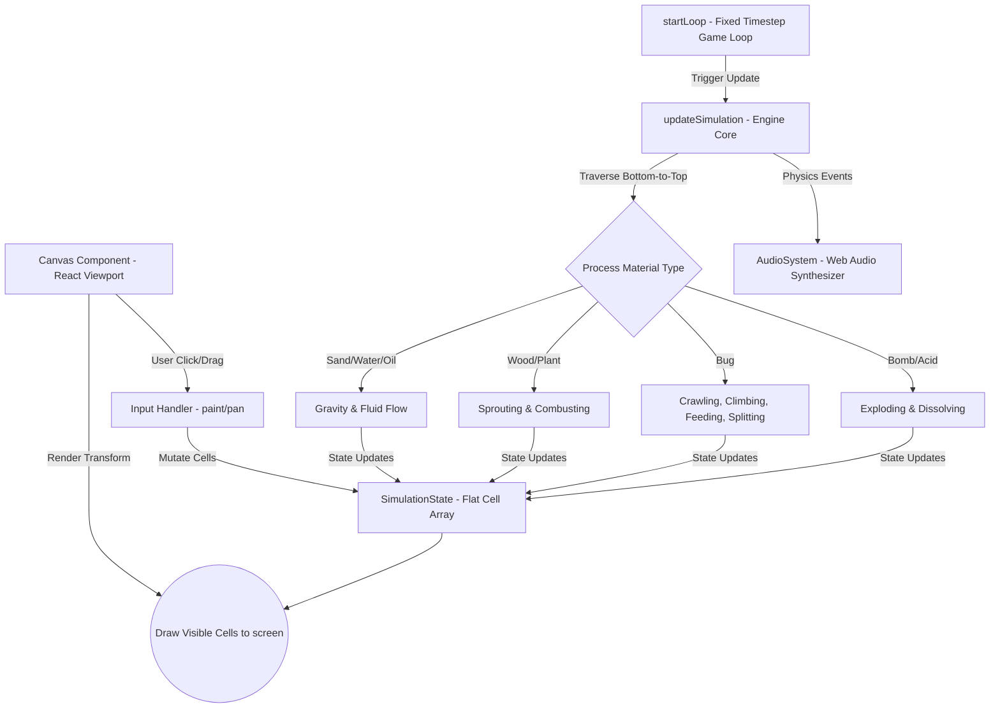
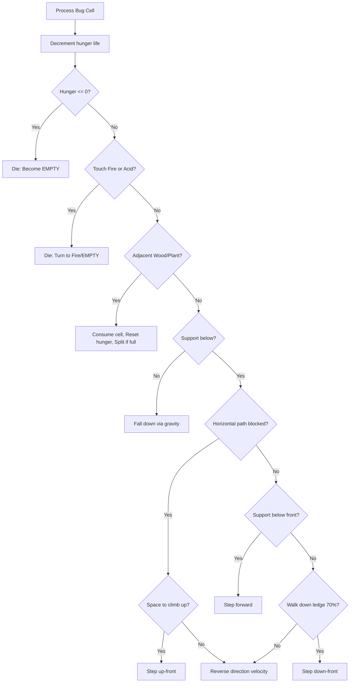

# ▞▀▖█  █ █▀▖ █ █ █▀▀ █▀▖ █  █ // GLYPHFALL
> **A Real-Time Monospaced ASCII Physics Simulation Sandbox**

GLYPHFALL is a retro-modern cellular automata simulation sandbox rendered entirely using monospaced ASCII glyphs. Inspired by classic terminal roguelikes (Dwarf Fortress, NetHack) and modern physics sandboxes, it features real-time fluid dynamics, fire propagation, corrosive chemistry, crawling organisms, and procedural audio synthesis wrapped in a high-contrast Phosphor Amber CRT workspace.

---

## Table of Contents
1. [Core Features](#core-features)
2. [Simulation Architecture](#simulation-architecture)
3. [Cellular Physics & Organisms](#cellular-physics--organisms)
   - [Physical Elements](#physical-elements)
   - [Living Crawlers (Bug AI)](#living-crawlers-bug-ai)
4. [Procedural Sound Synthesis](#procedural-sound-synthesis)
5. [Viewport Navigation & Camera](#viewport-navigation--camera)
6. [Project Structure](#project-structure)
7. [Getting Started](#getting-started)

---

## Core Features

* **Terminal Amber CRT Aesthetic**: A glowing phosphor workspace equipped with CSS scanlines, screen flickers, and copper-framed ASCII borders.
* **Pan & Zoom Viewport**: Center-aligned, scroll-wheel zooming and click-drag panning viewport allowing you to navigate an extensive `160x90` simulation space.
* **Procedural Web Audio Synth**: Synthesizes custom square, triangle, and sawtooth wave sound effects (explosions, water splashes, flame sizzles, acid fizzing, ticks, and clicks) in real-time.
* **Living Cellular Organisms**: Autonomous crawling bugs that climb walls, fall off ledges, forage for moss, and multiply when fed, alongside spreading plant foliage.
* **Rigid World Boundaries**: Visible static terrain borders integrated directly into the simulation grid to contain elements.

---

## Simulation Architecture

GLYPHFALL operates on a flat, row-major 1D array representing the 2D grid (`Index = Y * Width + X`) to maximize CPU cache locality. The engine updates from **bottom-to-top** each frame to process falling physics sequentially.



### Game Loop Timestep
The game loop runs a fixed timestep accumulator inside `requestAnimationFrame` targeted at 30 ticks per second:
1. Calculates delta time since the last frame.
2. Accumulates time to prevent active tab "spiral of death" lag spikes.
3. Steps the physics simulation in constant intervals.
4. Triggers rendering of updated cells.

---

## Cellular Physics & Organisms

### Physical Elements

| Element | Glyph(s) | Color Palette | Physical Behaviors |
| :--- | :---: | :--- | :--- |
| **WALL** | `█ ▓ ▒ ▩ ▤` | Earth Browns | Static, indestructible terrain. Frames the boundaries of the grid. |
| **SAND** | `░ ▒ ▓ .` | Desert Golds | Falls straight down; slides diagonally to form layered dunes. |
| **WATER** | `≈ ~ ≋ ∽` | Ocean Blues | Falls down, slides diagonally, and flows laterally. Shimmers dynamically. |
| **OIL** | `≈ ∽ ∾ ≋` | Dark Purples | Viscous fluid. Swaps places with Water to float. Catches fire instantly. |
| **FIRE** | `☼ ▲ * x` | Fire Gradients | Flickers and rises. Spreads to wood/plants. Extinguishes in Water. |
| **ACID** | `░ ▒ ☣ ≈` | Toxic Greens | Corrosive liquid. Dissolves adjacent solid cells into empty space on contact. |
| **WOOD** | `▰ ▱ 🪵 ╢` | Mahogany Browns | Solid structure. Sprouts moss/growths when watered. Ignites when burned. |
| **PLANT** | `v w γ "` | Forest Greens | Moss foliage. Grows and spreads when adjacent to water. Catches fire instantly. |

### Living Crawlers (Bug AI)

Bugs are represented by shifting monospaced leg glyphs (`m` -> `w` -> `n` -> `u`) that cycle to animate crawls. Their logic integrates gravity, pathfinding, climbing, foraging, and cloning:



---

## Procedural Sound Synthesis

The sound effects are generated programmatically via the **Web Audio API** without relying on static media files:
* **Explosion:** Synthesizes a loud downward sawtooth sweep alongside low-pass filtered noise to create a punchy rumble.
* **Splash:** High-frequency bandpass noise filtering with rapid exponential decay.
* **Sizzling/Crackle:** Generates very short high-pitched sawtooth pop envelopes.
* **Acid Fizz:** Sweeps triangle waves from 1200Hz down to 400Hz.
* **Bomb Tick:** Pure high-frequency square wave blips.
* **UI Click:** Warped sine wave click envelopes.

---

## Viewport Navigation & Camera

The workspace contains a viewport camera to navigate the `160x90` simulation space:
* **Panning:** Drag with **Right-Click**, **Middle-Click**, or **Shift + Left-Click** to slide the camera viewport. You can also toggle `[DRAG PAN MODE (P)]` in the sidebar to drag-pan using normal left clicks.
* **Zooming:** Scroll your mouse wheel centered around your cursor to zoom from `0.4x` to `3.5x`.
* **Frustum Culling:** Computes visible cell bounds relative to the viewport and culls non-visible elements to maximize frame rate.

---

## Project Structure

```
GLYPHFALL/
├── src/
│   ├── app/
│   │   ├── components/
│   │   │   └── Canvas.tsx     # Viewport HUD UI, preset maps, and mouse inputs
│   │   ├── globals.css        # Amber CRT phosphor style system & Swiss layout
│   │   ├── layout.tsx         # Page wrappers
│   │   └── page.tsx           # client import wrapper
│   ├── engine/
│   │   ├── audio.ts           # Web Audio API retro synth sound builders
│   │   ├── grid.ts            # Row-major flat indexing, swaps, and allocations
│   │   ├── loop.ts            # Fixed timestep game loop (raf-based accumulator)
│   │   ├── materials.ts       # Color/glyph sets and visual lifecycles
│   │   ├── simulation.ts      # Cellular automata update logic, physics, and Bug AI
│   │   └── types.ts           # Simulation grids & material enum definitions
│   └── input/
│       └── input.ts           # Multi-shape brush painting (circles, squares, lines)
├── package.json               # Next.js configurations
└── tsconfig.json              # TS configurations
```

---

## Getting Started

### Prerequisites
* Node.js (v18+)
* npm

### Installation & Run
1. Install dependencies:
   ```bash
   npm install
   ```
2. Start the local server:
   ```bash
   npm run dev
   ```
3. Open **[http://localhost:3000](http://localhost:3000)** in your browser.
